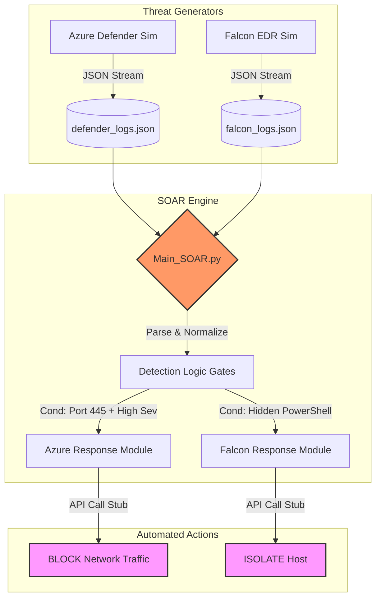

# 🛡️ SOC Simulator (SIEM/EDR/SOAR)

### A Universal Threat Emulation & Automated Response Engine


A modular, multi-threaded framework designed to emulate enterprise detection engineering workflows without requiring enterprise licenses. This project simulates the complete lifecycle of a SOC incident: from **CrowdStrike/Sysmon EDR telemetry** generation to **Microsoft Defender for Cloud** alerting, followed by automated **SOAR logic** for containment.

---

## 🏗️ Architecture

The system operates on a **Producer-Consumer model**, simulating a real-time event stream.



---

## 🚀 Setup & Usage

### 1. Installation
Clone the repository:
```bash
git clone https://github.com/Naifnizami/soc-simulator.git
cd soc-simulator
```

### 2. Run with Docker (Recommended)
This launches the complete microservices architecture (Generators + SOAR Engine + Log Volume).
```bash
docker-compose up --build
```

### 3. Observe Automation
You will see real-time colored log ingestion and logic triggers in the terminal:

```text
[Falcon] Agent Sent Telemetry: \Device\...\powershell.exe
[!!!] SOAR TRIGGERED: EDR Malware Detected on DESKTOP-HR-DUBAI-05
      ---> ACTION: API Call 'falconpy.hosts.update_device_tags(Action=ISOLATE)'
```

---

## 🛠️ Components

| Component | Function | Simulation Target |
| :--- | :--- | :--- |
| **azure_simulator.py** | Generates CSPM/CWP alerts | `Microsoft.Security/alerts` API |
| **falcon_simulator.py** | Generates Process Events | `ProcessRollup2` EDR Events |
| **soar_engine.py** | Ingests JSON, applies Rules | Splunk/FortiSOAR Playbooks |

---

## 🗺️ Roadmap
- [ ] **External Ingestion:** Add Splunk HEC support to push simulated logs to a real SIEM instance.
- [ ] **MITRE Mapping:** Tag simulated alerts with specific MITRE T-Codes (e.g., T1059.001 PowerShell).

---

*This tool is intended for educational purposes and detection engineering research.*
